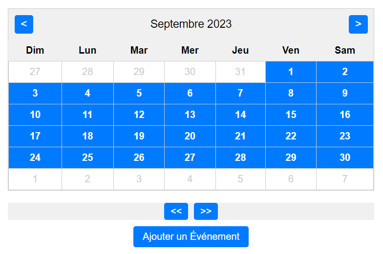

# Mon Plugin Calendrier Interactif

Mon Plugin Calendrier est un composant JavaScript qui vous permet de visualiser et de gérer des événements sur un calendrier.



## Fonctionnalités

- Affichage du calendrier mensuel avec la possibilité de naviguer vers les mois précédents et suivants.
- Sélection de dates pour ajouter des événements.
- Gestion des événements avec des descriptions personnalisées.
- Affichage des événements associés à une date sélectionnée.
- Compteur d'événements pour chaque jour du mois.

## Comment utiliser le plugin

1. Téléchargez les fichiers HTML, CSS et JavaScript du plugin et incluez-les dans votre projet.
2. Assurez-vous d'avoir la structure HTML fournie dans le fichier HTML pour le calendrier et les modals.
3. Personnalisez les styles CSS selon vos préférences pour s'intégrer à votre application.
4. Initialisez le plugin en appelant la fonction `generateCalendar()` pour afficher le calendrier initial.
5. Utilisez les boutons de navigation pour parcourir les mois et les années.
6. Cliquez sur une date dans le calendrier pour la sélectionner et afficher les événements associés.
7. Cliquez sur le bouton "Ajouter un Événement" pour ouvrir la modal et ajouter un nouvel événement.
8. Remplissez la date et le nom de l'événement dans le formulaire de la modal, puis cliquez sur "Ajouter" pour ajouter l'événement.
9. Les événements ajoutés seront affichés pour la date sélectionnée.

## Exemple d'utilisation

```html
<!DOCTYPE html>
<html>
<head>
    <title>Mon Plugin Calendrier avec Modal</title>
    <link rel="stylesheet" href="styles.css">
</head>
<body>
    <!-- Structure du calendrier et des modals -->
    <!-- ... -->
    
    <script src="calendar.js"></script>
</body>
</html>
```

```js
// Initialise le plugin de calendrier
generateCalendar();
```

## Système Pub/Sub

Le Plugin de Calendrier Interactif utilise un système de publication/abonnement (Pub/Sub) pour gérer les événements. Voici comment cela fonctionne :

- `pubSub` est un objet qui gère la publication et l'abonnement aux événements.
- La méthode `subscribe(eventName, fn)` permet de s'abonner à un événement en spécifiant le nom de l'événement et la fonction à exécuter lorsque l'événement est déclenché.
- La méthode `publish(eventName, data)` permet de déclencher un événement en spécifiant son nom et les données associées.
- Dans le code, nous utilisons `pubSub.subscribe` pour s'abonner à l'événement 'eventAdded', qui est déclenché chaque fois qu'un nouvel événement est ajouté.
- Lorsque 'eventAdded' est déclenché, il exécute une fonction qui affiche un message dans la console pour indiquer qu'un nouvel événement a été ajouté.

Exemple pour s'abonner à 'eventAdded' et exécuter du code lorsqu'un nouvel événement est ajouté :

```javascript
pubSub.subscribe('eventAdded', function(eventName) {
    console.log(`Un nouvel événement "${eventName}" a été ajouté !`);
});
```

Cette fonctionnalité permet d'ajouter des actions personnalisées à exécuter chaque fois qu'un événement est ajouté, ce qui peut être utile pour les notifications ou d'autres traitements spécifiques.

N'hésitez pas à personnaliser le comportement de l'abonnement à 'eventAdded' selon vos besoins.

## Dépendances

Aucune dépendance externe n'est requise pour ce plugin. Il utilise uniquement HTML, CSS et JavaScript natifs.

## Contributions

Les contributions à ce projet sont les bienvenues. Si vous souhaitez contribuer, veuillez ouvrir une demande d'extraction (pull request) avec vos modifications.

## Auteur

Ce projet a été développé par [Layf-créative](https://www.layf-creative.fr).

## Licence

Ce plugin est sous licence MIT. Vous êtes libre de l'utiliser et de le modifier selon vos besoins. Veuillez consulter le fichier [LICENSE](LICENCE) pour plus de détails.
